# SocialForum-WP-Frontend-Deploy

GENERA Project: The Platform's Social Forum Web Application
 
 

 &nbsp;&nbsp;
 

This Web Application is only a part of the Genera's official website. You can check it out by going: [here](https://life-genera.eu/index.php/forum-undec-dev/)
 
 

## Technologies

The **Genera's main website** was developed using the **WordPress** web framework, this is the reason why the Social Forum was built quite differently when compared with the rest of the Genera's Social Platform's Web Services.

Eschewing the use of modern web frameworks like React, I opted for a more foundational approach to web development for this project. Specifically, **I utilized the building blocks of the web** (listed below) to serve as the core technologies used.
 
 

 &nbsp;&nbsp;
 &nbsp;&nbsp;
 &nbsp;&nbsp;
 

- **HTML** (HyperText Markup Language, is the standard markup language used to create and design documents on the World Wide Web by defining their structure and layout)
- **CSS** (Cascading Style Sheets, is a style-sheet language used to describe the look and formatting of a document written in HTML, controlling layout, colors, fonts and more)

- **JavaScript** (A high-level, interpreted programming language primarily used to enhance interactivity and provide rich web content on client-side web applications)

However, given the nature of this project as a **Decentralized Application (DApp)**, and to improve the **Developer Experience (DX)**, I incorporated several modules. These modules are designed to streamline the coding process and facilitate efficient communication between the application's User Interface (UI) and the Blockchain Network's Smart Contracts, enhancing both the developer's workflow and the application's functionality.
 
 

 &nbsp;&nbsp;&nbsp;&nbsp;
 &nbsp;&nbsp;&nbsp;&nbsp;
 &nbsp;&nbsp;&nbsp;&nbsp;
 &nbsp;&nbsp;&nbsp;&nbsp;
 

- **Tailwind CSS** (A utility-first CSS framework packed with predefined classes that can be composed to build any design, directly in your markup)
- **Flowbite** (Flowbite is an open-source UI component library built on top of Tailwind CSS and based on the Flowbite Design System)
- **Ethers.js** (A JS Library, that is required in order to connect the app with the blockchain)

- **MetaMask** (A crypto wallet and gateway to blockchain apps, available as a browser extension and mobile app, primarily used for interacting with Ethereum-based decentralized applications (DApps))
   
   

## Website Guide

Once you visit the website, you will be greeted with the page presented in top of this document.

By clicking on any Post (currently available are: "The MERN Stack" and "Most Popular Web Development Tech-Stack (2023)") you shall be navigated to the Post's page. For this tutorial, I will be choosing the: "The MERN Stack".

From there, you will be able to perform a variety of actions:
 

- **Consume the static contect** (in simpler terms, read the Post's text)
- **Post Voting**: Vote on the particular **Post's Content** (available options are: _"Like"_ or _"Dislike"_)
- **Comment Voting**: Vote on the particular Post's **Comments** (available options are: _"Like"_ or _"Dislike"_)
- **Comment Submission**: Sumbit a Comment expressing your views regarding the specific topic

When performing any of these actions (**_except_** the 1st one: _"Content Comsumption"_) you will be prompted with a pop-up window to receive a reward.

> **What is this reward?** You can check out our Rewarding Tool's documentation: [here](https://github.com/jimzord12/RewardingTool-Frontend-Deploy/tree/master#description)

For our tutorial, I will be performing the **"Comment Voting"** action.

It is as simple as clicking on any Comment's "Like" or "Dislike" button
 

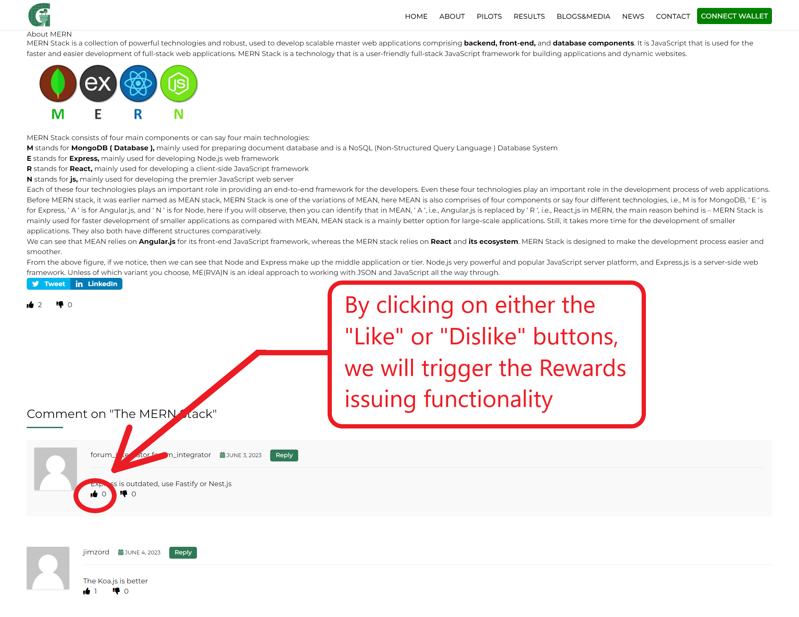 &nbsp;&nbsp;
 

Immediately after, a pop-up window (known as a modal) will appear.
 

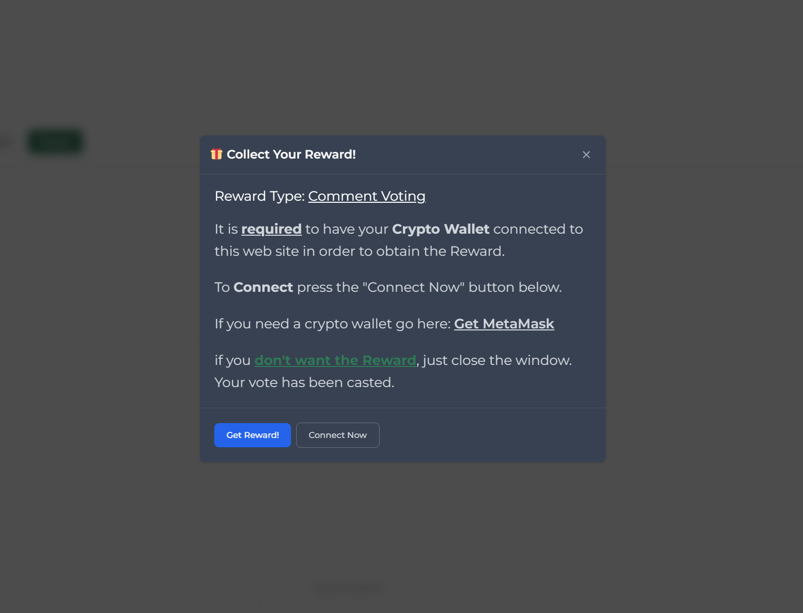 &nbsp;&nbsp;
 
 

As the modal window description mentions, we must **possess** (have installed as an extension) and also have **connected a crypto wallet (MetaMask) to the website**.

> **No idea what a crypto wallet even is?** You can check a short video I have recorded: [here (empty)](https://youtube.com/)

Futhermore, if you do not desire to get involved in this blockchain madness, you can always just close the window. This window shall not interfere with the rest of the site's provided features or functionality.

Moving forward, I will assume that you have MetaMask installed as an extension in your currently using browser.

As we have not yet connected our crypto wallet to the website (common practice when interacting with Dapps) we can click the "Connect Now" button to let MetaMask know that we wish to connect it with the site.

> **A quick note**, if you try to obtain the Reward by clicking the "Get Reward" button without having your wallet connected, this will happen:
>  

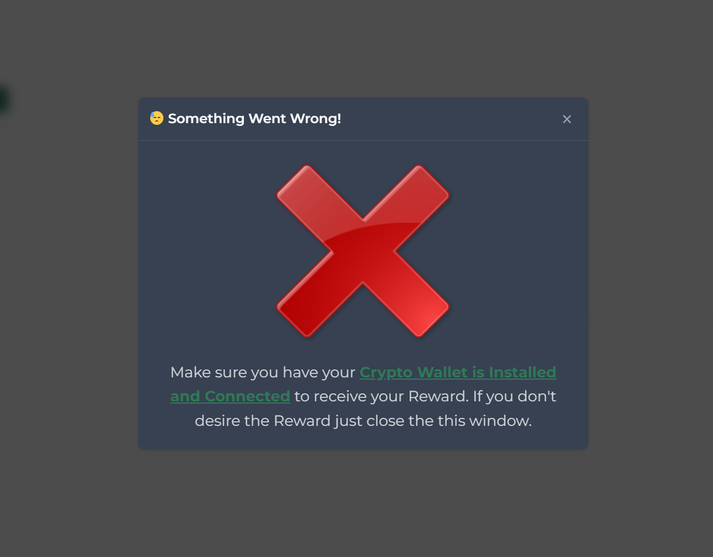 &nbsp;&nbsp;
 
 

Once the "Connect Now" button is clicked, MetaMask will prompt you with a window in order to receive your blessing and start the site connecting process.

Connection Window Step: 1/2 - Select the Account you wish to be connected to the site and then click "Next".
 

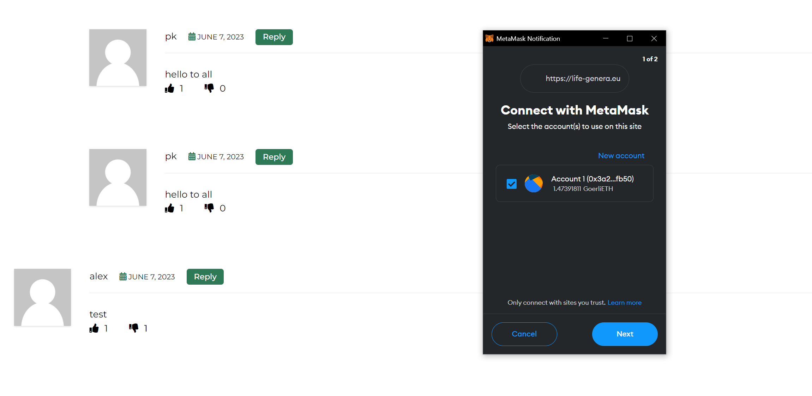 &nbsp;&nbsp;
 
 

Connection Window Step: 2/2 - Authorize the Connection by clicking the "Connect" button.
 

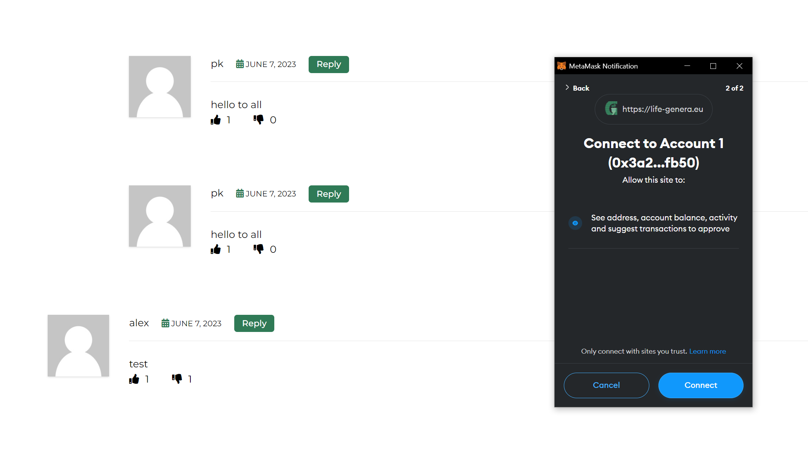 &nbsp;&nbsp;
 
 

Perfect, now our wallet is connected to the site and we can start interacting with the site's web3 features.

The time has arrived to go and explore (a little bit) MetaMask and how the web3 cosmos works. Don't worry I will not over do it 😁

1. Open MetaMask
    

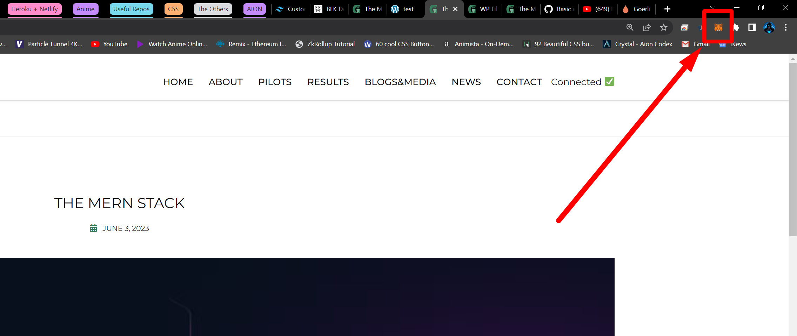 &nbsp;&nbsp;
 
 

2. This window will appear
    

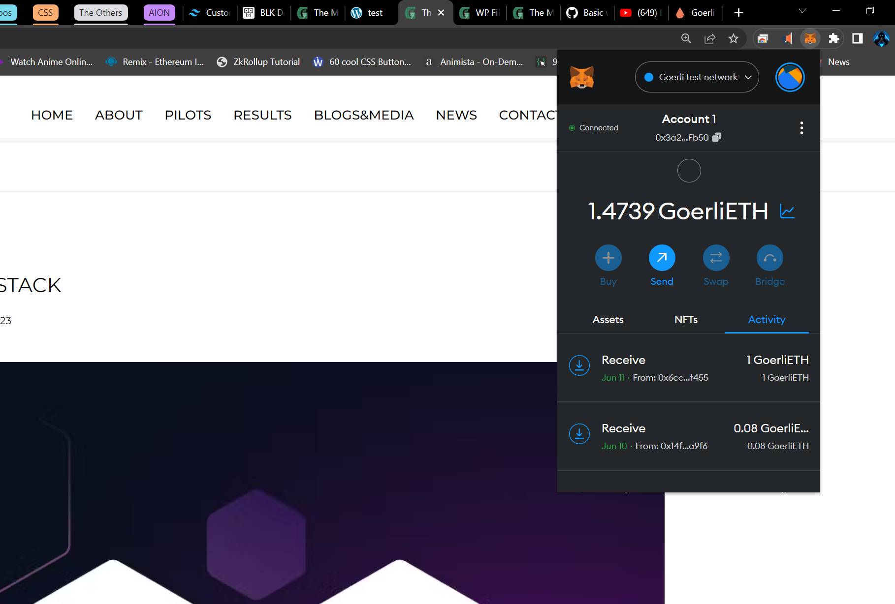 &nbsp;&nbsp;
 
 

3. Click the three dots, as shown below
    

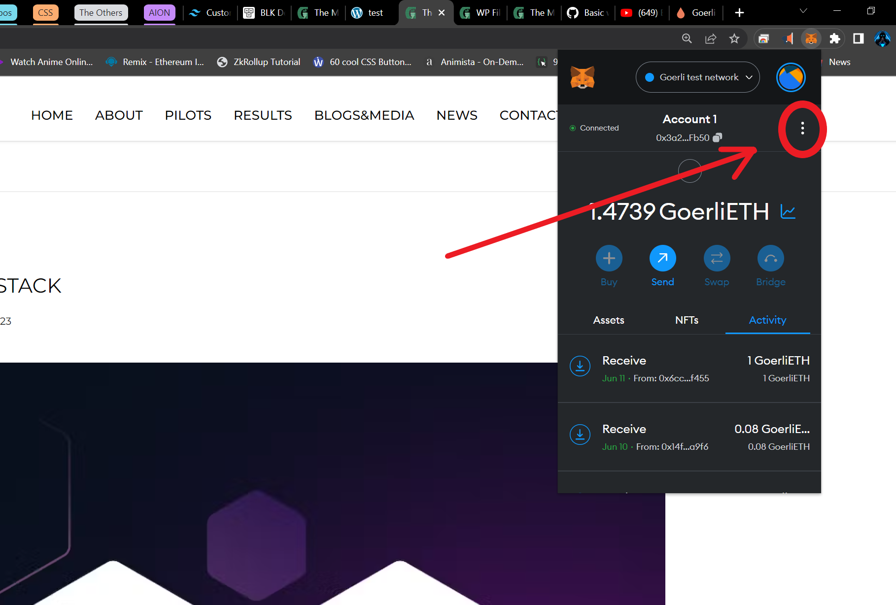 &nbsp;&nbsp;
 
 

4. Now, click Expand view
    

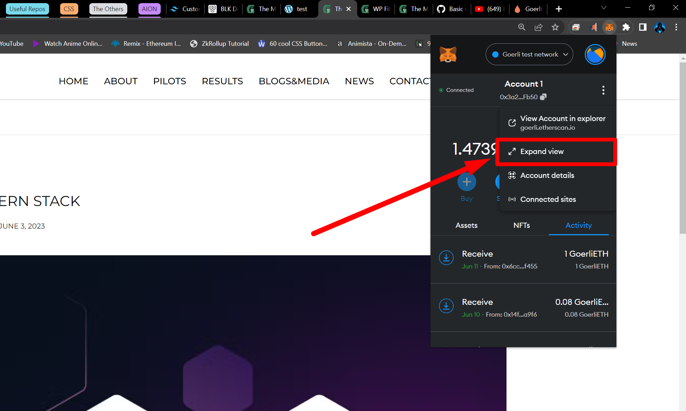 &nbsp;&nbsp;
 
 

5. Here I skipped a step, you must click the oval button named, in my case, "Goerli test network". In your case, it probably says "Ethereum Mainnet". Once the dropdown menu appears, click "Add network".
    

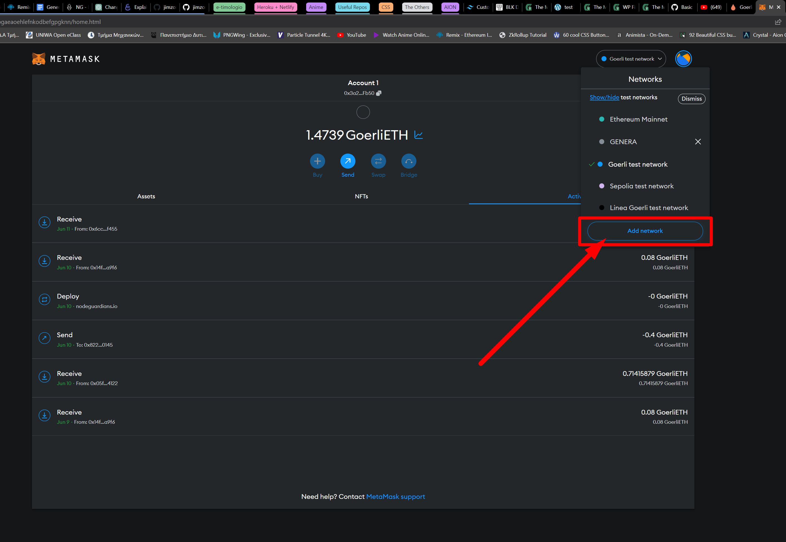 &nbsp;&nbsp;

> **Why are even doing all of this?** This process is required because the Smart Contracts that hold the logic for the Rewarding System reside inside the GENERA Private Blockchain Network.

> **Networks Analogy**: To wrap your head around all of these different networks concept, think of each network as a separate Planet existing in the Web3 Universe. Each Planet, has its own smart contracts, its own native currency and cannot directly communicate with other Planets.

> **Conrtacts Analogy**: Now to get a feeling of the Smart Contracts' role in this space, you can think of them as Shops that exist on these Planets. Let's say that I have developed a Smart Contract named "Jimmy's Awesome Pastry" and I deploy it (open the shop publicly) to GENERA's Network. This means, that if an user wishes to buy my insanly tasty creations, he/she will have to come to the GENERA Planet and grab these pastries. However note, that this does not stop me from creating an Pastry Empire across the whole wide Web3 Universe 🤑. But as in the real world, every one of my Pastry Shops will be unique and probably be a little different than the others as it is on another Planet. On each Planet, the requlations, taxes, etc. may be slightly different 😉.

> **Users Perspective Analogy**: When users interact with their Crypto Wallets by changing the network their Wallet is pointing to (as we are about to do in this tutorial) it's like they are teleporting from Planet to Planet. Depending the Planet they are currently on, their assets (digital and/or physical) will change. This is to be expected, as it is like you are in Japan and try to use Euros to pay for something. Their native currency is Yen, so your monetary assets (Euros) will not be acceptable. Futhermore, if your heart longs for the superb paste of my pastries but I have yet to establish a Shop in the Planet your assets currently reside, you must find a way to convert/swap them for the native currency that is used in a Planet that hosts one of my Shops. This opens an exciting world of finance capabilites called DeFi, which is out the scope of this tutorial, regretfully 😥.

Let's get back on track, by clicking the "Add networks" button you shall be navigated to the page below:
 

6. Click the "Add a network manually" blue link in the bottom
    

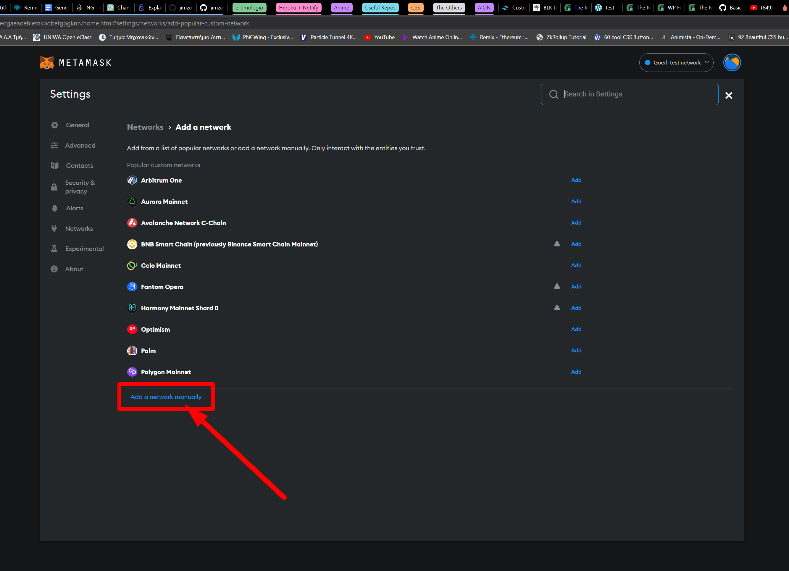 &nbsp;&nbsp;
 
 

7. Then you will see this page, I am not going explain it, every important information is written onto the image
    

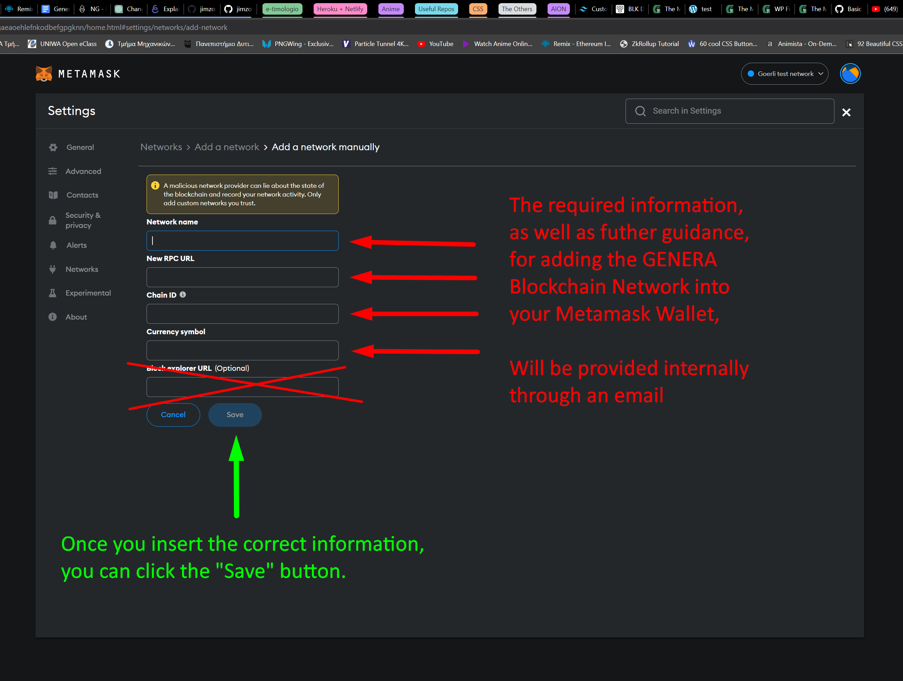 &nbsp;&nbsp;
 
 

8. After that go to the MetaMask's home page. If it does not happen automatically, click the MetaMask Logo, located at the top-left corner. Then click once more the Networks' oval button, which is next to your Account's Icon.
    

 &nbsp;&nbsp;
 
 

9. And finally, choose the "GENERA" network. Yes, you did it! 🎊 Congratulations! 🎊
    

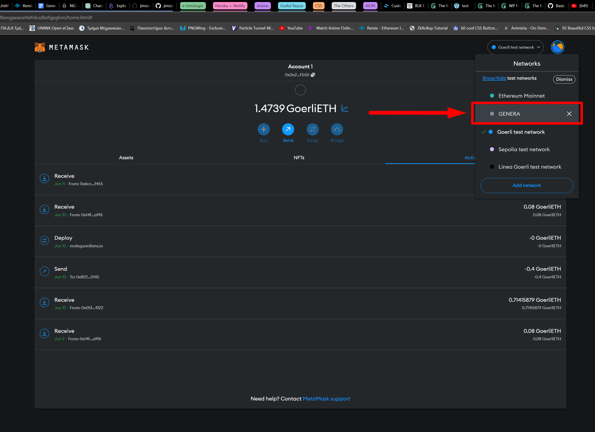 &nbsp;&nbsp;
 
 

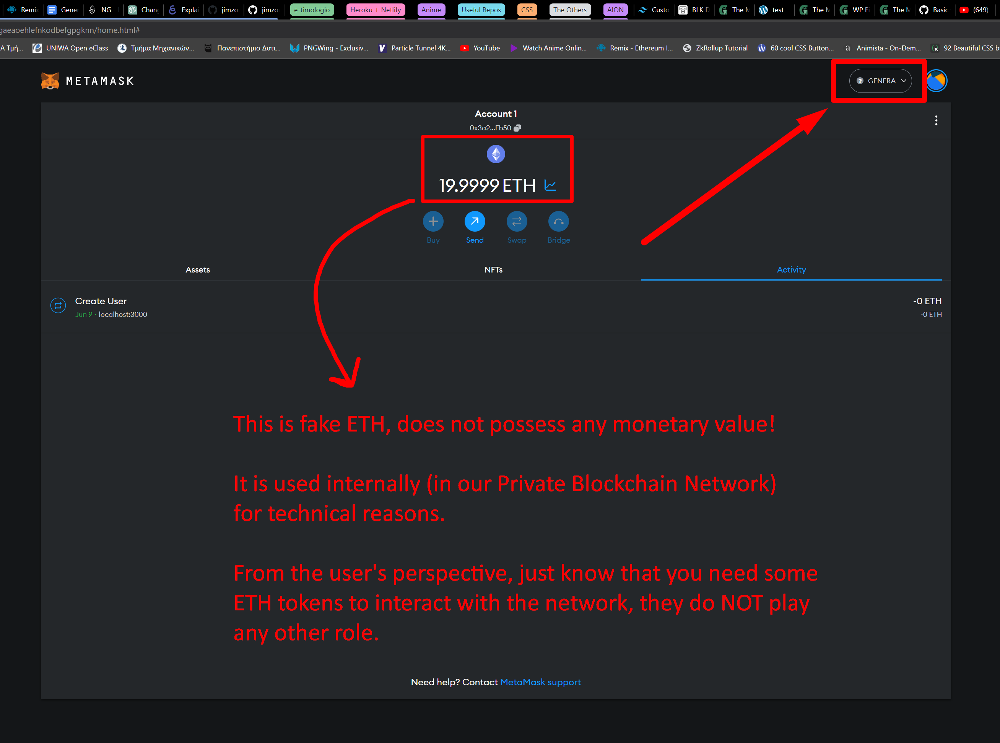 &nbsp;&nbsp;
 
 

 

 &nbsp;&nbsp;
 
 

I hope you didn't think that it was over 😂. I got you there 😋. Don't worry, hold up just a tiny bit more we are almost done. Our final task shall be to change the your Account's Name to make it more user friendly. I will spare you the explanations as it is quite simple, just let the images guide you.
 

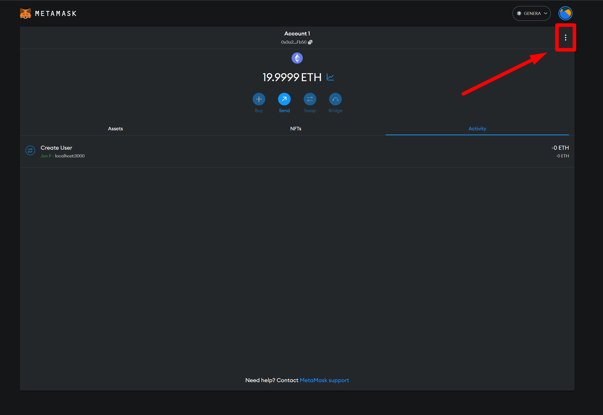 &nbsp;&nbsp;
 
 

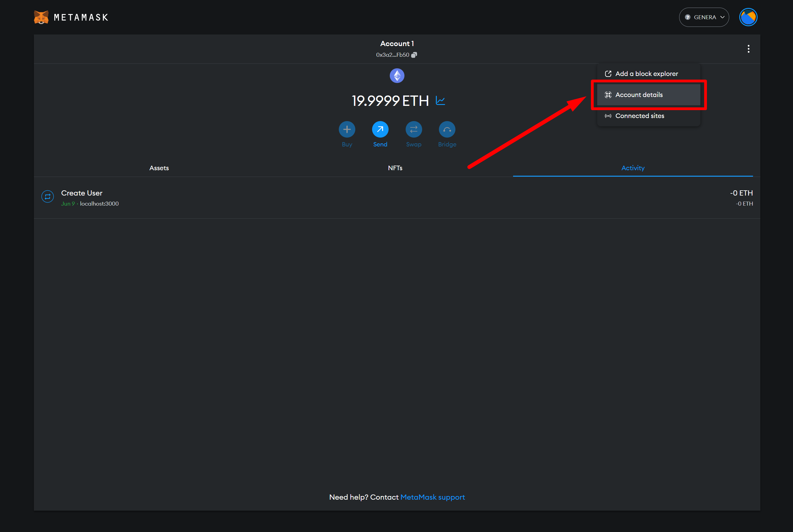 &nbsp;&nbsp;
 
 

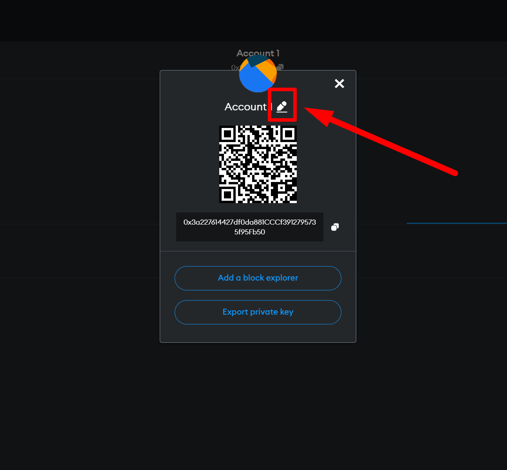 &nbsp;&nbsp;
 
 

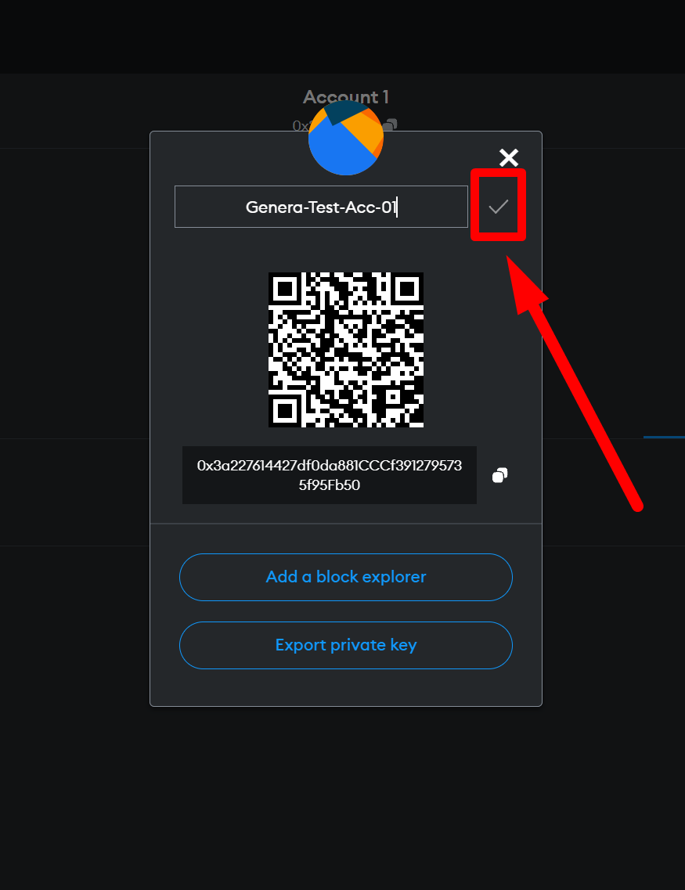 &nbsp;&nbsp;
 
 

You are all set! You may go and start enjoying your newly obtained Web3 Powers! All the work you performed here will be paid back when you start interacting with other Dapps. All that you have learned have turned you from a regular Web 2.0 user into a Web 3.0 specialist (I might exaggerate I little bit 😁)!

Regrettably, we must pick up the tutorial from where we left off, as all of this was merely a detour, a side quest, in our main adventure 😅.

To get you up to speed, we were about to get our hands on the promised Reward as we interacted with the Social Forum's features.

To achieve this, we only have to click the "Like" or "Dislike" Button once more, and this old modal will appear before our very eyes.
 

 &nbsp;&nbsp;
 
 

> **Ultra fast note**: If you now, that you are already connected, press the "Connect Now" button. Nothing special will happen, the button's text and styles will change in order to remind the User that he/she is already connected 😉

 

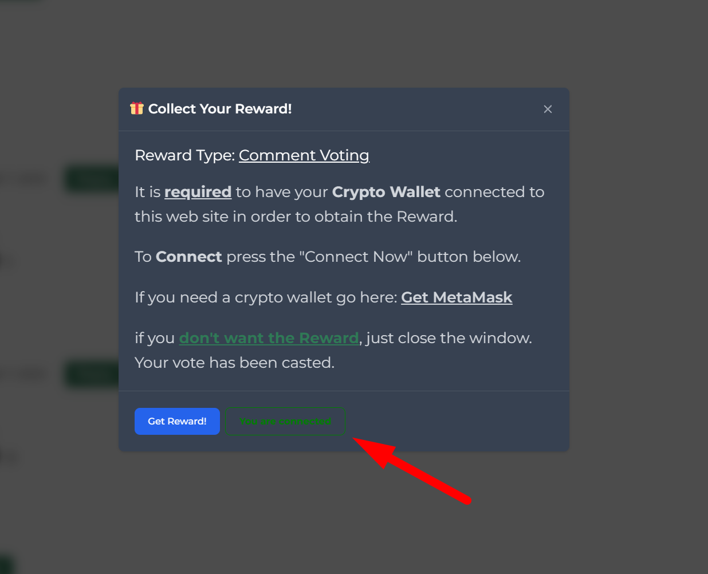 &nbsp;&nbsp;
 
 

By clicking the "Get Reward!" button...
 

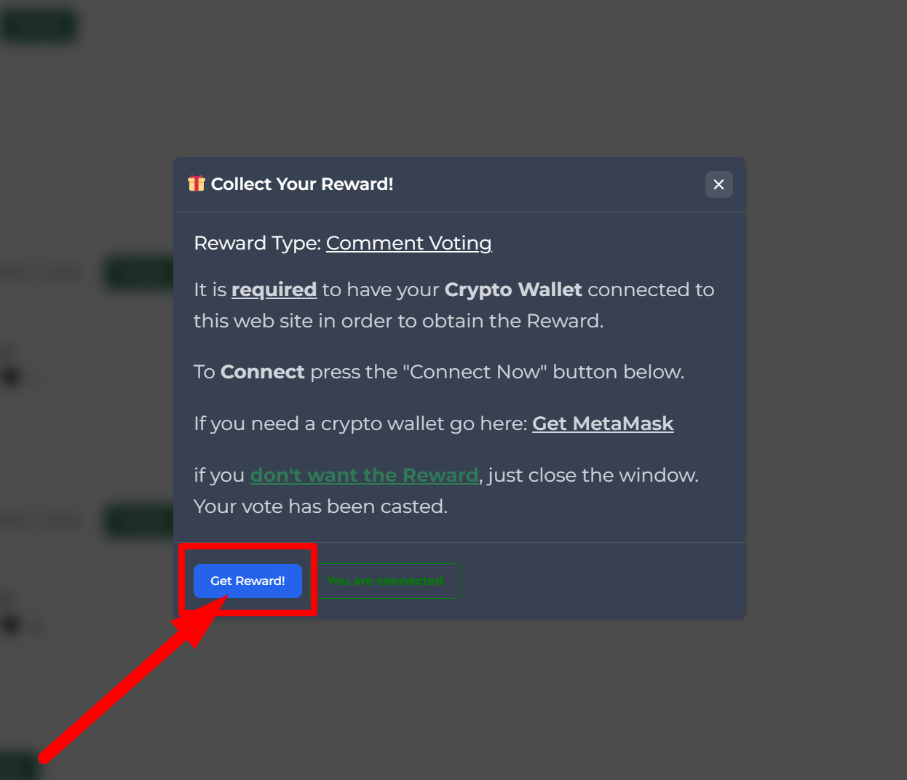 &nbsp;&nbsp;
 
 

MetaMask will automatically notice that a Web3 feature is about to initialize and it will open a window.
 
If you don't really feel like it, just press "Confirm" and do not pay attention to image's information. It's not necessary to understand it now.
 

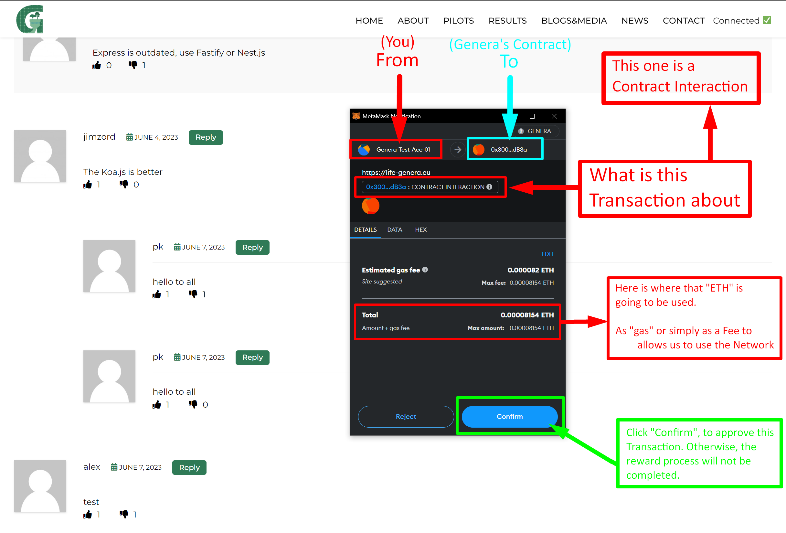 &nbsp;&nbsp;
 
 

After confirming the transition (don't worry about it, in blockchain everything is a transaction 😐) you ought to wait patiently until the Network's nodes start performing their mystic arts in order for your transaction to be evaluated and confirmed. The duration for a transaction to be approved, is very volatile because it depends on a variety of variables. But in our particular Network it can take from 10 up to 60 seconds.

At some point, the transaction will be approved. You will be notified of this event by the alert message that is going to be shown at the bottom-right corner of the page. Important, if you refresh the page or do anything similar the alert message will not appear.

 

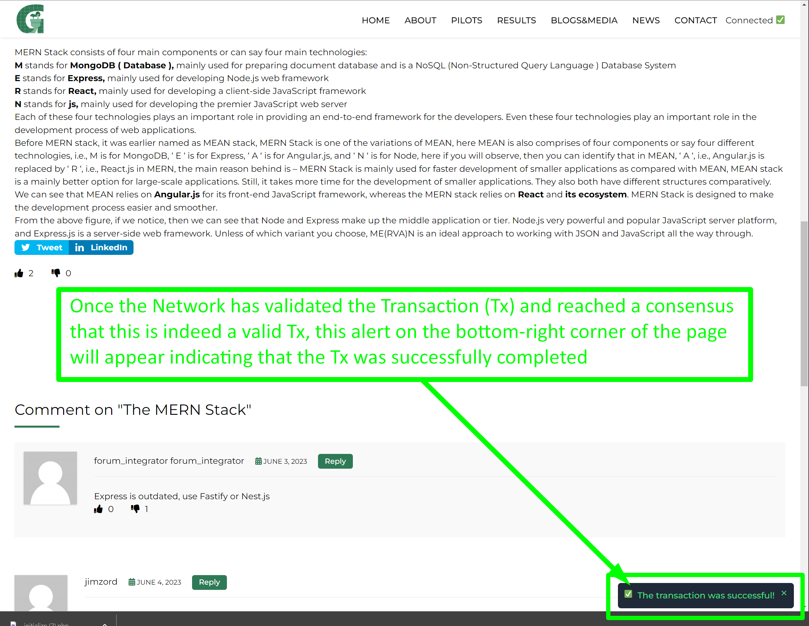 &nbsp;&nbsp;
 
 

This is trully (I pinky swear 🤣) the end of this tutorial!!! Once again, 🎉🎉 Congratulation 🎉🎉

 

 &nbsp;&nbsp;

> If you are curious about..., and now what? What does this reward represent? And more importantly, how can I use it? Take a look at our Rewarding Tool Documentation: [right here](https://github.com/jimzord12/RewardingTool-Frontend-Deploy/tree/master#description)
