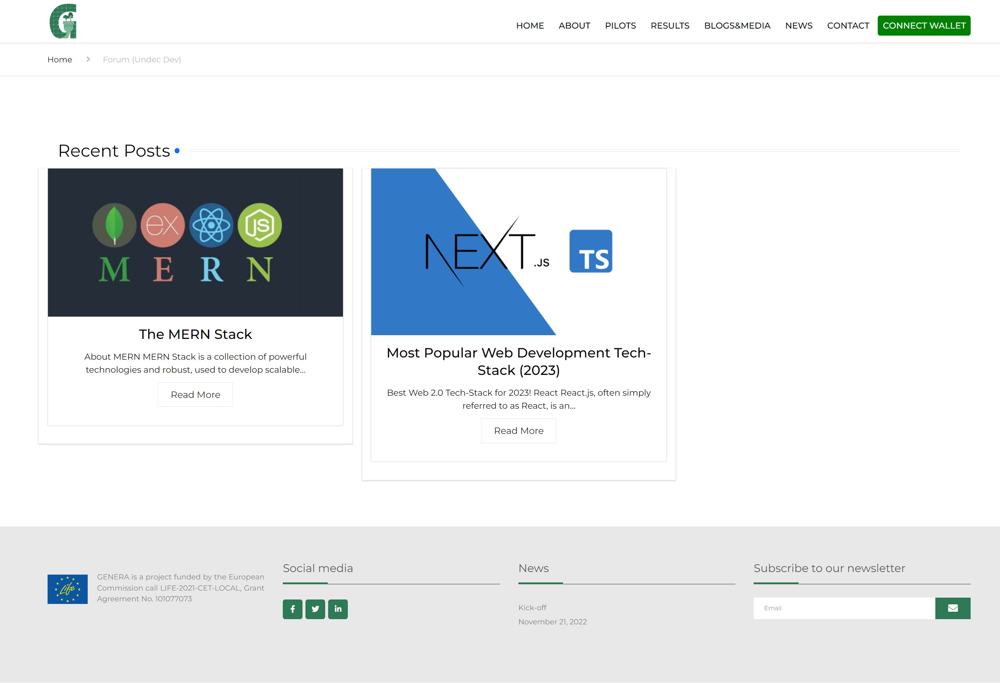

# SocialForum-WP-Frontend-Deploy

GENERA Project: The Platform's Social Forum Web Application
 
 

 &nbsp;&nbsp;
 

This Web Application is only a part of the Genera's official website. You can check it out by going: [here](https://life-genera.eu/index.php/forum-undec-dev/)
 

## Technologies

The **Genera's main website** was developed using the **WordPress** web framework, this is the reason why the Social Forum was built quite differently when compared with the rest of the Genera's Social Platform's Web Services.

Eschewing the use of modern web frameworks like React, I opted for a more foundational approach to web development for this project. Specifically, **I utilized the building blocks of the web** (listed below) to serve as the core technologies used.
 
 

 &nbsp;&nbsp;
 &nbsp;&nbsp;
 &nbsp;&nbsp;
 

However, given the nature of this project as a **Decentralized Application (DApp)**, and to improve the **Developer Experience (DX)**, I incorporated several modules. These modules are designed to streamline the coding process and facilitate efficient communication between the application's User Interface (UI) and the Blockchain Network's Smart Contracts, enhancing both the developer's workflow and the application's functionality.
 
 

 &nbsp;&nbsp;&nbsp;&nbsp;
 &nbsp;&nbsp;&nbsp;&nbsp;
 &nbsp;&nbsp;&nbsp;&nbsp;
 &nbsp;&nbsp;&nbsp;&nbsp;
 

- **TailWind CSS** (A utility-first CSS framework packed with predefined classes that can be composed to build any design, directly in your markup)
- **Flowbite** (Flowbite is an open-source UI component library built on top of Tailwind CSS and based on the Flowbite Design System)
- **Ethers.js** (A JS Library, that is required in order to connect the app with the blockchain)

- **MetaMask** (A crypto wallet and gateway to blockchain apps, available as a browser extension and mobile app, primarily used for interacting with Ethereum-based decentralized applications (DApps).)
   

## Website Guide

Once you visit the website, you will be greeted with the page presented in top of this document.

By clicking on any Post (currently available are: "The MERN Stack" and "Most Popular Web Development Tech-Stack (2023)") you shall be navigated to the Post's page. For this tutorial, I will be choosing the: "The MERN Stack".

From there, you will be able to perform a variety of actions:
 

- **Consume the static contect** (in simpler terms, read the Post's text)
- **Post Voting**: Vote on the particular **Post's Content** (available options are: _"Like"_ or _"Dislike"_)
- **Comment Voting**: Vote on the particular Post's **Comments** (available options are: _"Like"_ or _"Dislike"_)
- **Comment Submission**: Sumbit a Comment expressing your views regarding the specific topic

When performing any of these actions (**_excluding_** the 1st one: _"Content Comsumption"_) you will be prompted with a pop-up window to receive a reward.

> **What is this reward?** You can check out our Rewarding Tool's documentation: [here](https://github.com/jimzord12/RewardingTool-Frontend-Deploy/tree/master#readme)

For our tutorial, I will be performing the "Comment Voting
